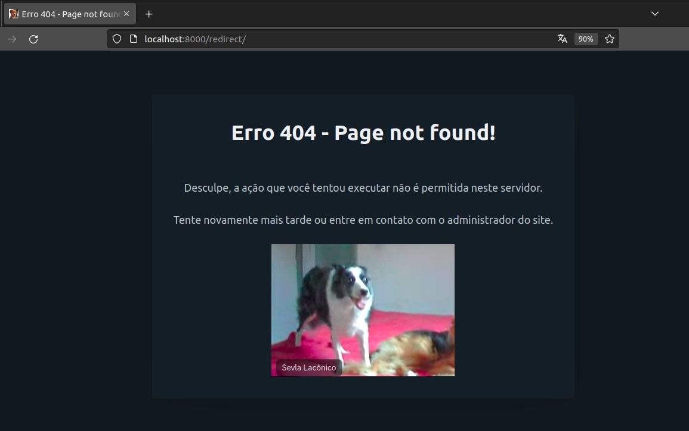
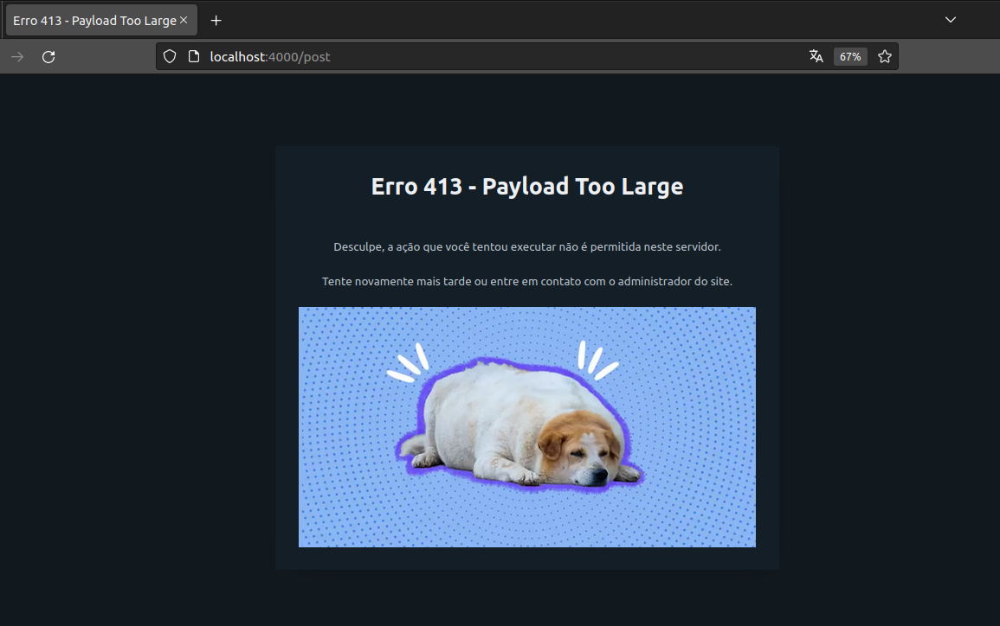

<p align="center">
  <a href="READMEPT.md">
    
  <strong>PT</strong>
  </a>
</p>

<h1 align=center>Webserv</h1>

## About the implementation

A server developed by   <a href="https://github.com/leaozim">Larissa</a>  and <a href="https://github.com/rodrigo-br">Rodrigo</a>, dedicated to sharing pictures of their dogs on the web.

<h4 align=center>
	<b>Emily e Nico</b>
</h4>
<p align="center">
    
</p>

<h4 align=center>
	<b>Arya</b>
</h4>
<p align="center">
    
</p>

## Webserv: An HTTP Server in C++98

The Webserv project is an HTTP server written in C++98, following the HTTP (Hypertext Transfer Protocol) protocol. HTTP is an application protocol that serves as the foundation for data communication on the World Wide Web, enabling the distribution of hypertext documents with hyperlinks to resources accessible through web browsers.   

## Objective
The main goal of this project is to implement an efficient and non-blocking HTTP server that can be configured through a configuration file. It can define ports, hosts, default error pages, request body size limits, and more. The server supports HTTP methods, including GET, POST, and DELETE, making it suitable for serving web pages and handling various HTTP requests.

## Requirements

To compile and run this project, you'll need the following items:

- C++ compiler with support for C++98 standard (GCC or Clang recommended).
    ```sh
    sudo apt update && sudo apt install g++
    ```
- libcurl library (for HTTP request features).
    ```sh
    sudo apt update && sudo apt install libcurl4-openssl-dev
    ```

## Compilation

To compile the project, follow these steps:

1. Clone this repository to your local system.
2. Make sure you have a C++ compiler installed on your machine.
3. Make sure you have the libcurl library installed on your system.
4. Navigate to the root directory of the project (where the Makefile is located).
5. Run the `make` command to compile the project.

## How to Run Webserv

 ```sh
./webserv [configuration file] 
```

## About configuration

- Default Configuration File

There is a default configuration file at the path conf/default.conf that contains initial server configurations.
```sh
./webserv conf/default.conf
```
- .conf File Extension

All configuration files must have the .conf extension for the system to recognize them correctly as configuration files.

- Restricted Comments

It's important to emphasize that configuration files should not include comments, and neither should they contain ";".

## Server configuration

#### Port 

To specify the port on which the server will listen, use the `listen` directive followed by the desired port number.
```
listen 8000
```

#### Root Directory 
To define the root directory for the server, use the root directive and specify the path to the desired directory.

```
root wwwroot
```
#### Server Names 

To set the server names, use the `server_names` directive followed by the desired server names, each on a separate line:

```
server_names lade-lim.42.fr
server_names localhost
``````

#### Request Body Size Limit
To establish a limit for the size of the request body, use the body_size_limit directive and specify the desired value.
```
body_size_limit 6666666
```
#### Error Page 

To specify a custom error page for a specific error, mention the error you want to customize, followed by the desired error code, and the path to the new error page:

```
404 /index.html;
```

#### Locations

Location with definition of methods 
```
location / {
    http_methods 1; # Allows only the GET method (1)
    index index.html; # Defines the index file for this location
}
location / {
    http_methods 2; # Allows only the POST method (2)
    index index.html; # Defines the index file for this location
}

location / {
    http_methods 4; # Allows only the DELETE method (4)
    index index.html; # Defines the index file for this location
}

location / {
    http_methods 5; # Allows the methods GET (1) and DELETE (4)
    index index.html; # Defines the index file for this location
}

location / {
    http_methods 6; # Allows the methods POST (2) and DELETE (4)
    index index.html; # Defines the index file for this location
}

location / {
    http_methods 7; # Allows the methods GET (1), POST (2), and DELETE (4)
    index index.html; # Defines the index file for this location
}
```

Location with CGI
```
location /cgi-bin {
    http_methods 7; # Allows the methods GET (1), POST (2), and DELETE (4)
    index cavalinho.html; # Defines the index file for this location
    cgi_pass .py; # Specifies that .py files will be executed as CGI in this location
}
```

 Location with directory_listing
```
location /directory {
    directory_listing on; # Enables directory listing for this location
}
```

 Location with redirection

```
    location /redirect {
        redirect index.html; # Defines a redirection to index.html
    }

```
## Examples of some configured routes.

<p align="center">
    
</p>


<p align="center">
    
</p>

<p align="center">
    
</p>